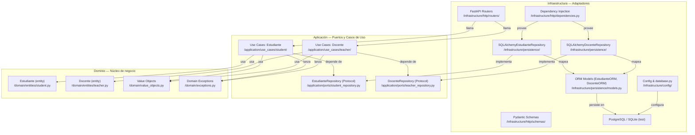
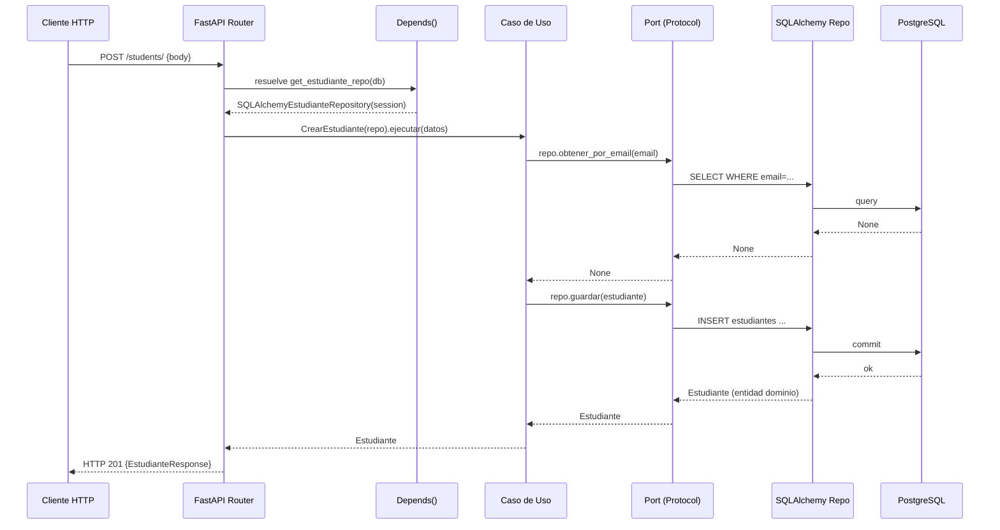

# Design Document — Hexagonal Architecture Refactor

## Overview

Este documento describe el diseño técnico para refactorizar el **Sistema de Gestión Académica** desde su estructura plana actual hacia una **arquitectura hexagonal** (Ports & Adapters). El resultado final preserva íntegramente todos los contratos de API HTTP, esquemas de respuesta y comportamientos observables, mientras introduce una separación de capas que permite probar la lógica de negocio de forma aislada, sin base de datos ni framework web.

La transformación es **behavior-preserving**: los tests existentes en `tests/test_students.py` y `tests/test_integration.py` deben seguir pasando sin modificaciones.

---

## Architecture

### Diagrama de capas hexagonales



### Flujo de una solicitud HTTP



---

## Components and Interfaces

### Estructura de directorios post-refactorización

```
app/
├── main.py                          # Solo: instancia FastAPI, registra routers, CORS
│
├── domain/
│   ├── __init__.py
│   ├── exceptions.py                # EntidadNoEncontrada, ConflictoDeUnicidad, ValidacionDominio
│   ├── value_objects.py             # Email, NumeroDocumento, Especialidad
│   └── entities/
│       ├── __init__.py
│       ├── student.py               # Entidad Estudiante (Python puro)
│       └── teacher.py               # Entidad Docente (Python puro)
│
├── application/
│   ├── __init__.py
│   ├── ports/
│   │   ├── __init__.py
│   │   ├── student_repository.py    # Protocol EstudianteRepository
│   │   └── teacher_repository.py    # Protocol DocenteRepository
│   └── use_cases/
│       ├── __init__.py
│       ├── student/
│       │   ├── __init__.py
│       │   ├── crear_estudiante.py
│       │   ├── obtener_estudiante.py
│       │   ├── listar_estudiantes.py
│       │   ├── actualizar_estudiante.py
│       │   └── eliminar_estudiante.py
│       └── teacher/
│           ├── __init__.py
│           ├── crear_docente.py
│           ├── obtener_docente.py
│           ├── listar_docentes.py
│           ├── actualizar_docente.py
│           └── eliminar_docente.py
│
└── infrastructure/
    ├── __init__.py
    ├── config/
    │   ├── __init__.py
    │   ├── settings.py              # Migrado desde app/config.py
    │   └── database.py              # Motor SQLAlchemy, get_db, verificar_conexion
    ├── http/
    │   ├── __init__.py
    │   ├── dependencies.py          # Funciones Depends() para inyectar repos
    │   ├── routers/
    │   │   ├── __init__.py
    │   │   ├── students.py          # 5 endpoints CRUD estudiantes
    │   │   └── teachers.py          # 5 endpoints CRUD docentes
    │   └── schemas/
    │       ├── __init__.py
    │       ├── student.py           # EstudianteCreate, EstudianteUpdate, EstudianteResponse, EstudiantePaginado
    │       └── teacher.py           # DocenteCreate, DocenteUpdate, DocenteResponse, DocentePaginado
    └── persistence/
        ├── __init__.py
        ├── models.py                # EstudianteORM, DocenteORM (SQLAlchemy mapped classes)
        ├── student_repository.py    # SQLAlchemyEstudianteRepository
        └── teacher_repository.py    # SQLAlchemyDocenteRepository
```

> `app/crud.py`, `app/models.py`, `app/schemas.py` y `app/config.py` se eliminan una vez que todos sus símbolos públicos estén accesibles desde las nuevas rutas.

---

## Data Models

### Entidades de Dominio

Las entidades son clases Python puras (`dataclass` o clase regular) sin ninguna dependencia de SQLAlchemy, FastAPI ni Pydantic.

#### `app/domain/entities/student.py`

```python
from dataclasses import dataclass, field
from datetime import datetime, timezone
from uuid import UUID, uuid4

@dataclass
class Estudiante:
    nombre: str
    direccion: str
    numero_documento: str
    email: str
    id: int = 0                        # 0 = no persistido aún
    activo: bool = True
    fecha_creacion: datetime = field(
        default_factory=lambda: datetime.now(timezone.utc)
    )
```

> **Decisión de diseño**: se mantiene `id: int` (clave primaria autoincremental) en lugar de UUID para conservar compatibilidad con el esquema de BD existente y los contratos de API que devuelven `"id": 1`. Introducir UUID rompería la API pública y los tests existentes.

#### `app/domain/entities/teacher.py`

```python
from dataclasses import dataclass, field
from datetime import datetime, timezone

@dataclass
class Docente:
    nombre: str
    email: str
    especialidad: str
    id: int = 0
    activo: bool = True
    fecha_creacion: datetime = field(
        default_factory=lambda: datetime.now(timezone.utc)
    )
```

### Value Objects

#### `app/domain/value_objects.py`

```python
import re
from dataclasses import dataclass

@dataclass(frozen=True)  # frozen=True garantiza inmutabilidad
class Email:
    valor: str

    def __post_init__(self):
        v = self.valor
        if "@" not in v:
            raise ValueError(f"Email inválido '{v}': debe contener '@'.")
        prefix, _, domain = v.partition("@")
        if not prefix:
            raise ValueError(f"Email inválido '{v}': el prefijo no puede estar vacío.")
        if "." not in domain:
            raise ValueError(
                f"Email inválido '{v}': el dominio debe contener al menos un punto."
            )

@dataclass(frozen=True)
class NumeroDocumento:
    valor: str
    _PATRON = re.compile(r"^[A-Za-z0-9\-]{3,30}$")

    def __post_init__(self):
        if not self._PATRON.match(self.valor):
            raise ValueError(
                f"NumeroDocumento inválido '{self.valor}': "
                "debe tener entre 3 y 30 caracteres alfanuméricos o guiones."
            )

@dataclass(frozen=True)
class Especialidad:
    valor: str

    def __post_init__(self):
        if not self.valor:
            raise ValueError("Especialidad no puede estar vacía.")
        if len(self.valor) > 100:
            raise ValueError(
                f"Especialidad '{self.valor[:20]}…' supera el límite de 100 caracteres."
            )
```

> **Nota**: los value objects se usan opcionalmente en los casos de uso para validación pre-persistencia. Los esquemas Pydantic en la capa HTTP siguen realizando la validación de entrada externa (manteniendo los 422 de la API actual).

### Excepciones de Dominio

#### `app/domain/exceptions.py`

```python
class EntidadNoEncontrada(Exception):
    """Lanzada cuando un caso de uso no encuentra la entidad solicitada."""
    def __init__(self, entidad: str, identificador):
        self.entidad = entidad
        self.identificador = identificador
        super().__init__(f"{entidad} con id={identificador!r} no encontrado.")

class ConflictoDeUnicidad(Exception):
    """Lanzada cuando se viola una restricción de unicidad."""
    def __init__(self, campo: str, valor: str = ""):
        self.campo = campo
        self.valor = valor
        super().__init__(f"Ya existe un registro con {campo}={valor!r}.")

class ValidacionDominio(Exception):
    """Lanzada cuando los datos de entrada violan una regla de negocio del dominio."""
    def __init__(self, campo: str, mensaje: str):
        self.campo = campo
        super().__init__(f"Validación fallida en '{campo}': {mensaje}")
```

### Puertos (Interfaces Abstractas)

#### `app/application/ports/student_repository.py`

```python
from typing import Optional, Protocol, runtime_checkable
from app.domain.entities.student import Estudiante

@runtime_checkable
class EstudianteRepository(Protocol):
    def guardar(self, estudiante: Estudiante) -> Estudiante:
        """Inserta o actualiza un estudiante. Lanza ConflictoDeUnicidad si hay duplicado."""
        ...
    def obtener_por_id(self, id: int) -> Optional[Estudiante]:
        """Devuelve el estudiante con el id dado, o None si no existe."""
        ...
    def obtener_por_email(self, email: str) -> Optional[Estudiante]:
        """Devuelve el estudiante con el email dado, o None si no existe."""
        ...
    def obtener_por_documento(self, documento: str) -> Optional[Estudiante]:
        """Devuelve el estudiante con el numero_documento dado, o None si no existe."""
        ...
    def listar(
        self,
        pagina: int = 1,
        por_pagina: int = 10,
        solo_activos: Optional[bool] = None,
    ) -> tuple[list[Estudiante], int]:
        """Devuelve (lista paginada, total). pagina es 1-based."""
        ...
    def eliminar(self, id: int) -> bool:
        """Elimina el estudiante con el id dado. Devuelve True si existía."""
        ...
```

#### `app/application/ports/teacher_repository.py`

Estructura análoga para `DocenteRepository`, con métodos: `guardar`, `obtener_por_id`, `obtener_por_email`, `obtener_por_especialidad`, `listar`, `eliminar`.

### Casos de Uso

Cada caso de uso es una clase con un único método público `ejecutar(...)`. Recibe el repositorio por constructor.

**Ejemplo: `app/application/use_cases/student/crear_estudiante.py`**

```python
from app.application.ports.student_repository import EstudianteRepository
from app.domain.entities.student import Estudiante
from app.domain.exceptions import ConflictoDeUnicidad

class CrearEstudiante:
    def __init__(self, repo: EstudianteRepository):
        self._repo = repo

    def ejecutar(self, nombre: str, direccion: str, numero_documento: str, email: str) -> Estudiante:
        if self._repo.obtener_por_email(email):
            raise ConflictoDeUnicidad("email", email)
        if self._repo.obtener_por_documento(numero_documento):
            raise ConflictoDeUnicidad("numero_documento", numero_documento)
        estudiante = Estudiante(
            nombre=nombre,
            direccion=direccion,
            numero_documento=numero_documento,
            email=email,
        )
        return self._repo.guardar(estudiante)
```

**Tabla de casos de uso y sus responsabilidades:**

| Archivo | Clase | Parámetros de `ejecutar` | Excepciones lanzadas |
|---|---|---|---|
| `crear_estudiante.py` | `CrearEstudiante` | nombre, direccion, numero_documento, email | `ConflictoDeUnicidad` |
| `obtener_estudiante.py` | `ObtenerEstudiante` | id: int | `EntidadNoEncontrada` |
| `listar_estudiantes.py` | `ListarEstudiantes` | pagina, por_pagina, solo_activos | — |
| `actualizar_estudiante.py` | `ActualizarEstudiante` | id, **campos | `EntidadNoEncontrada`, `ConflictoDeUnicidad` |
| `eliminar_estudiante.py` | `EliminarEstudiante` | id: int | `EntidadNoEncontrada` |

Los casos de uso de docentes siguen la misma estructura, sustituyendo `Estudiante` por `Docente` y añadiendo el campo `especialidad`.

### Adaptadores de Persistencia (SQLAlchemy)

#### `app/infrastructure/persistence/models.py`

Modelos ORM que replican exactamente el esquema actual. Se renombran internamente para evitar colisión con las entidades de dominio:

```python
from app.infrastructure.config.database import Base

class EstudianteORM(Base):
    __tablename__ = "estudiantes"
    # columnas idénticas al models.py actual

class DocenteORM(Base):
    __tablename__ = "docentes"
    # columnas idénticas al models.py actual
```

Cada repositorio SQLAlchemy implementa la conversión bidireccional:

```python
# ORM → entidad dominio
def _a_dominio(self, orm: EstudianteORM) -> Estudiante: ...

# entidad dominio → ORM
def _a_orm(self, entidad: Estudiante) -> EstudianteORM: ...
```

Cuando `IntegrityError` es capturada en `guardar`, se hace rollback y se relanza como `ConflictoDeUnicidad`:

```python
except IntegrityError as exc:
    self._session.rollback()
    msg = str(exc.orig).lower()
    campo = "email" if "email" in msg else "numero_documento"
    raise ConflictoDeUnicidad(campo) from exc
```

### Adaptadores HTTP (FastAPI)

Los routers son adaptadores delgados que:
1. Validan la entrada con esquemas Pydantic (capa HTTP)
2. Construyen y ejecutan el caso de uso
3. Traducen excepciones de dominio a respuestas HTTP

```python
# app/infrastructure/http/routers/students.py
@router.post("/", response_model=EstudianteResponse, status_code=201)
def crear_estudiante(
    datos: EstudianteCreate,
    repo: EstudianteRepository = Depends(get_estudiante_repo),
):
    try:
        entidad = CrearEstudiante(repo).ejecutar(
            nombre=datos.nombre,
            direccion=datos.direccion,
            numero_documento=datos.numero_documento,
            email=str(datos.email),
        )
        return _a_response(entidad)
    except ConflictoDeUnicidad as exc:
        raise HTTPException(status_code=409, detail=str(exc))
```

**Mapeo de excepciones de dominio a HTTP:**

| Excepción de dominio | Código HTTP |
|---|---|
| `EntidadNoEncontrada` | 404 |
| `ConflictoDeUnicidad` | 409 |
| `ValidacionDominio` | 422 |

### Inyección de Dependencias

#### `app/infrastructure/http/dependencies.py`

```python
from fastapi import Depends
from sqlalchemy.orm import Session
from app.infrastructure.config.database import get_db
from app.infrastructure.persistence.student_repository import SQLAlchemyEstudianteRepository
from app.infrastructure.persistence.teacher_repository import SQLAlchemyDocenteRepository

def get_estudiante_repo(db: Session = Depends(get_db)) -> SQLAlchemyEstudianteRepository:
    return SQLAlchemyEstudianteRepository(db)

def get_docente_repo(db: Session = Depends(get_db)) -> SQLAlchemyDocenteRepository:
    return SQLAlchemyDocenteRepository(db)
```

El `conftest.py` de tests sobreescribe `get_db` (no los repos) — esto mantiene la compatibilidad con los tests existentes:

```python
# conftest.py (sin cambios respecto al actual, salvo actualizar los imports de Base y get_db)
from app.infrastructure.config.database import Base, get_db
app.dependency_overrides[get_db] = override_get_db
```

---

## Correctness Properties

*Una propiedad es una característica o comportamiento que debe mantenerse verdadera en todas las ejecuciones válidas del sistema — esencialmente, una afirmación formal sobre lo que el sistema debe hacer. Las propiedades sirven como puente entre las especificaciones legibles por humanos y las garantías de corrección verificables automáticamente.*

Las propiedades a continuación se implementan con **Hypothesis** (ya presente en `requirements.txt`) y cubren la capa de Dominio y la capa de Aplicación usando repositorios en memoria. No se utilizan ni base de datos real ni framework HTTP.

---

### Property 1: Round-trip de Value Objects

*Para cualquier* cadena que cumpla los criterios de validez de `Email`, `NumeroDocumento` y `Especialidad`, construir el value object correspondiente y leer su atributo `.valor` debe devolver exactamente la cadena original.

**Validates: Requirements 2.1, 2.2, 2.3**

---

### Property 2: Email rechaza entradas inválidas

*Para cualquier* cadena que no contenga el símbolo `@`, o en la que el prefijo antes de `@` esté vacío, o en la que el dominio no contenga al menos un punto, construir `Email(cadena)` debe lanzar `ValueError`.

**Validates: Requirements 2.4**

---

### Property 3: NumeroDocumento rechaza entradas inválidas

*Para cualquier* cadena que no cumpla el patrón `^[A-Za-z0-9\-]{3,30}$` (demasiado corta, demasiado larga, o con caracteres no permitidos), construir `NumeroDocumento(cadena)` debe lanzar `ValueError`.

**Validates: Requirements 2.5**

---

### Property 4: Especialidad rechaza entradas inválidas

*Para cualquier* cadena vacía o con más de 100 caracteres, construir `Especialidad(cadena)` debe lanzar `ValueError`.

**Validates: Requirements 2.6**

---

### Property 5: Value Objects son inmutables

*Para cualquier* instancia válida de `Email`, `NumeroDocumento` o `Especialidad`, intentar reasignar el atributo `.valor` debe lanzar `AttributeError` (o `FrozenInstanceError`).

**Validates: Requirements 2.3**

---

### Property 6: Repositorio en memoria devuelve None para IDs desconocidos

*Para cualquier* entero positivo que no haya sido usado como ID al guardar ningún estudiante en el repositorio en memoria, `obtener_por_id(id)` debe devolver `None`. De forma análoga, `obtener_por_email` y `obtener_por_documento` devuelven `None` para valores no almacenados.

**Validates: Requirements 3.6**

---

### Property 7: Casos de Uso lanzan EntidadNoEncontrada para entidades inexistentes

*Para cualquier* repositorio en memoria vacío y cualquier entero positivo como identificador, ejecutar `ObtenerEstudiante`, `ActualizarEstudiante` o `EliminarEstudiante` con ese identificador debe lanzar `EntidadNoEncontrada`, sin modificar el estado del repositorio.

**Validates: Requirements 4.4, 4.8**

---

### Property 8: Casos de Uso lanzan ConflictoDeUnicidad para campos únicos duplicados

*Para cualquier* estudiante almacenado en el repositorio en memoria, llamar a `CrearEstudiante` con el mismo `email` o el mismo `numero_documento` debe lanzar `ConflictoDeUnicidad` sin persistir ningún registro adicional.

**Validates: Requirements 4.5**

---

### Property 9: Actualizar sin campos es una operación sin efecto

*Para cualquier* estudiante almacenado en el repositorio en memoria, llamar a `ActualizarEstudiante` con un diccionario de campos vacío debe devolver la entidad con los mismos valores que tenía, y el repositorio no debe haber recibido ninguna llamada de escritura.

**Validates: Requirements 4.7**

---

### Property 10: Invariante de paginación

*Para cualquier* cantidad `n` de estudiantes almacenados y cualquier valor válido de `por_pagina` entre 1 y 100, el resultado de `ListarEstudiantes` debe cumplir: `len(estudiantes) <= por_pagina` y `total == n` (cuando no se aplica filtro de activo).

**Validates: Requirements 6.8**

---

### Property 11: Entradas inválidas al Caso de Uso no mutan el repositorio

*Para cualquier* entrada que viole una regla de dominio (campo obligatorio ausente, nombre vacío, email mal formado), el caso de uso debe lanzar una excepción que no sea `HTTPException`, y el número de entidades en el repositorio en memoria debe ser idéntico antes y después de la llamada.

**Validates: Requirements 4.3, 6.6**

---

## Error Handling

### Estrategia de propagación de excepciones por capa

```
Dominio        →  lanza: ValueError, EntidadNoEncontrada, ConflictoDeUnicidad, ValidacionDominio
                  nunca importa: HTTPException, IntegrityError

Aplicación     →  propaga excepciones de dominio tal como están
                  nunca las convierte en HTTPException

Infraestructura/Persistencia →
                  captura: IntegrityError → relanza como ConflictoDeUnicidad
                  propaga sin modificar: cualquier otra excepción de BD

Infraestructura/HTTP →
                  captura: EntidadNoEncontrada → HTTP 404
                  captura: ConflictoDeUnicidad → HTTP 409
                  captura: ValidacionDominio → HTTP 422
                  deja pasar: cualquier otra excepción (→ FastAPI la convierte en HTTP 500)
```

### Health check y errores de conexión

El endpoint `GET /health` llama a `verificar_conexion()` desde `app/infrastructure/config/database.py`. Si la BD no responde, devuelve HTTP 503. Si `get_db` no puede establecer conexión, la excepción se propaga y FastAPI devuelve HTTP 503 automáticamente.

---

## Testing Strategy

### Enfoque dual: pruebas unitarias + pruebas de propiedades

#### Pruebas unitarias

Cubren escenarios concretos, casos borde y puntos de integración:

- **`tests/test_students.py`** (existentes, sin modificar) — ejercen la pila completa con SQLite en memoria vía `dependency_overrides`.
- **`tests/test_integration.py`** (existentes, sin modificar) — ejercen la pila completa contra PostgreSQL real.
- **`tests/test_domain.py`** (nuevas) — pruebas de entidades, value objects y excepciones de dominio con ejemplos concretos.
- **`tests/test_use_cases.py`** (nuevas) — pruebas de casos de uso con repositorios en memoria, sin BD ni HTTP.

#### Repositorios en memoria para pruebas

```python
# tests/fakes/in_memory_student_repository.py
class InMemoryEstudianteRepository:
    def __init__(self):
        self._store: dict[int, Estudiante] = {}
        self._next_id = 1

    def guardar(self, e: Estudiante) -> Estudiante:
        # chequea unicidad de email y numero_documento
        ...
        if e.id == 0:
            e = replace(e, id=self._next_id)
            self._next_id += 1
        self._store[e.id] = e
        return e

    def obtener_por_id(self, id: int) -> Optional[Estudiante]:
        return self._store.get(id)

    # ... resto de métodos
```

#### Pruebas de propiedades con Hypothesis

```python
# tests/test_properties.py
from hypothesis import given, settings
from hypothesis import strategies as st

# Property 1: Round-trip de Email
@given(st.emails())
@settings(max_examples=200)
def test_email_roundtrip(email_str):
    """Feature: hexagonal-architecture-refactor, Property 1: Round-trip de Value Objects"""
    vo = Email(email_str)
    assert vo.valor == email_str

# Property 9: Actualizar sin campos es una operación sin efecto
@given(estudiante_valido_strategy())
@settings(max_examples=200)
def test_actualizar_vacio_es_noop(estudiante):
    """Feature: hexagonal-architecture-refactor, Property 9: Actualizar sin campos es una operación sin efecto"""
    repo = InMemoryEstudianteRepository()
    guardado = repo.guardar(estudiante)
    antes = len(repo._store)
    resultado = ActualizarEstudiante(repo).ejecutar(guardado.id, **{})
    assert resultado == guardado
    assert len(repo._store) == antes
```

**Configuración de Hypothesis**: mínimo 200 iteraciones por propiedad de dominio (se especifica con `@settings(max_examples=200)`).

**Tag format para rastreo**: cada test de propiedad lleva un comentario o docstring con el formato:  
`Feature: hexagonal-architecture-refactor, Property {N}: {texto_de_la_propiedad}`

#### Compatibilidad con la suite existente

El `conftest.py` actual solo necesita actualizar dos imports:

```python
# Antes
from app.database import Base, get_db
from app.models import Docente, Estudiante  # solo en teardown de PostgreSQL

# Después
from app.infrastructure.config.database import Base, get_db
from app.domain.entities.student import Estudiante
from app.domain.entities.teacher import Docente
```

Ningún otro cambio en `conftest.py`. El mecanismo `app.dependency_overrides[get_db]` sigue funcionando exactamente igual.

### Estrategia de migración para preservar contratos

1. **Fase 1 — Dominio**: crear entidades, value objects y excepciones. No modificar nada existente. Ejecutar `pytest` — 0 fallos.
2. **Fase 2 — Puertos**: crear los Protocols. No modificar nada existente. Ejecutar `pytest` — 0 fallos.
3. **Fase 3 — Casos de Uso**: crear los casos de uso con repos en memoria. Ejecutar `pytest` — 0 fallos.
4. **Fase 4 — Adaptador de Persistencia**: crear los repos SQLAlchemy. Los routers existentes aún no los usan. Ejecutar `pytest` — 0 fallos.
5. **Fase 5 — Adaptador HTTP**: reemplazar los routers. Ejecutar `pytest` — debe seguir habiendo 0 fallos.
6. **Fase 6 — DI y main.py**: actualizar `main.py` y `dependencies.py`. Actualizar imports en `conftest.py`. Ejecutar `pytest` — 0 fallos.
7. **Fase 7 — Limpieza**: eliminar `app/crud.py`, `app/models.py`, `app/schemas.py`, `app/config.py`. Ejecutar `pytest` — 0 fallos.

Cada fase termina con una ejecución verde de `pytest tests/ -v`. Esto garantiza que nunca haya un estado roto durante la migración.
