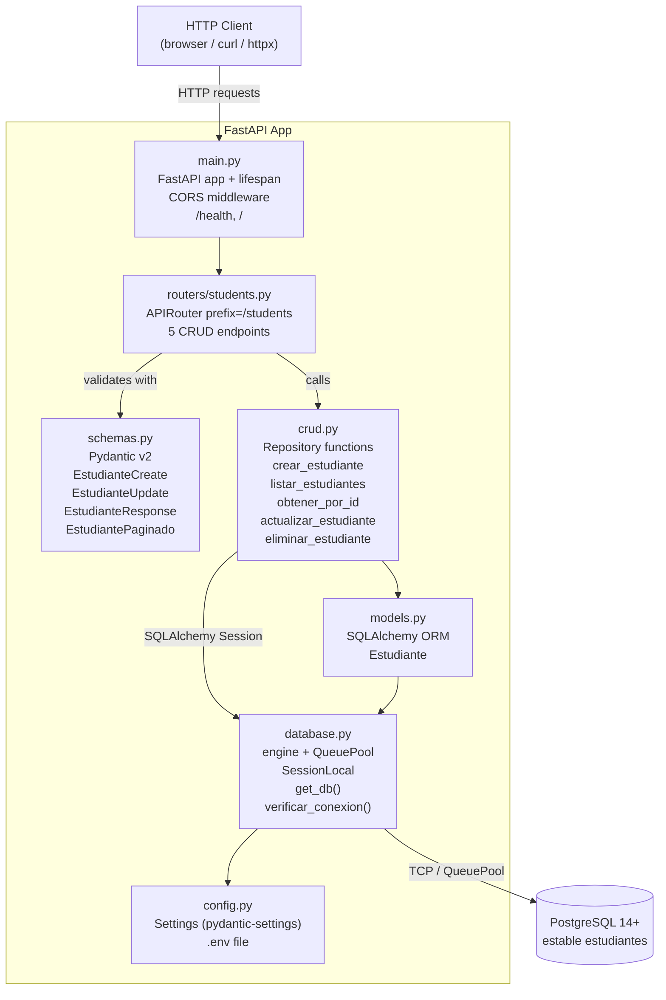
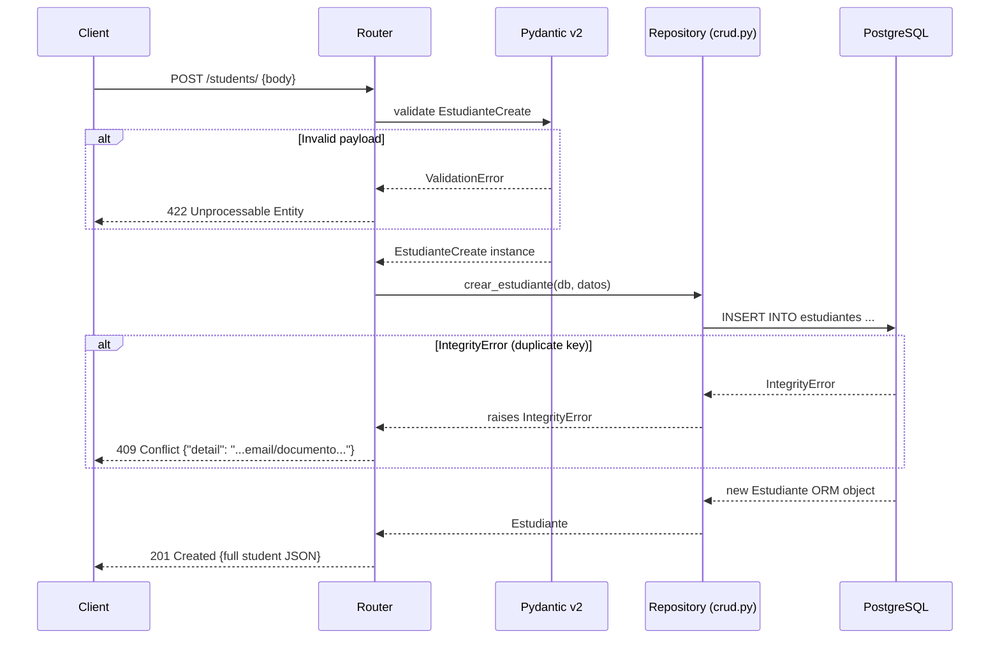
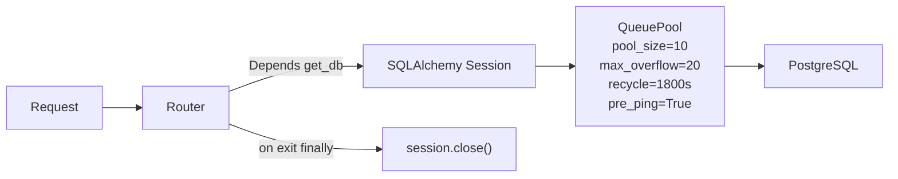
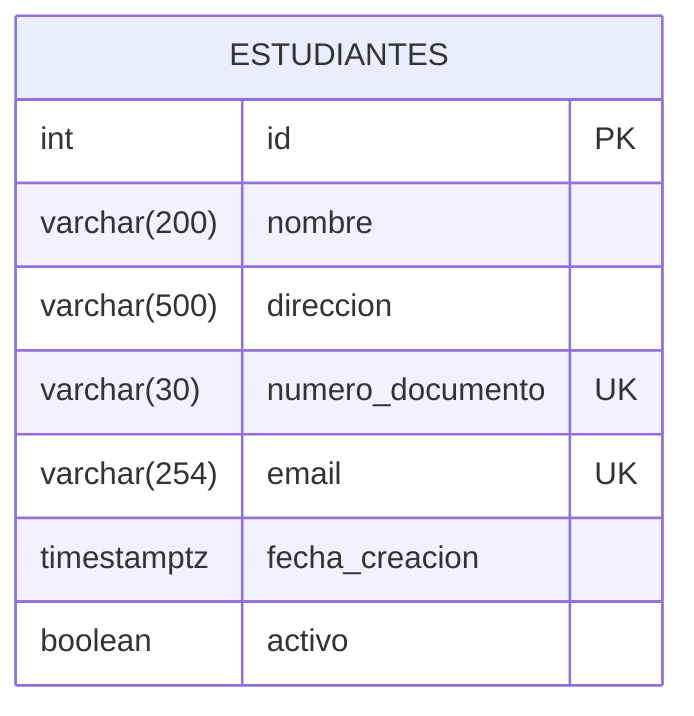
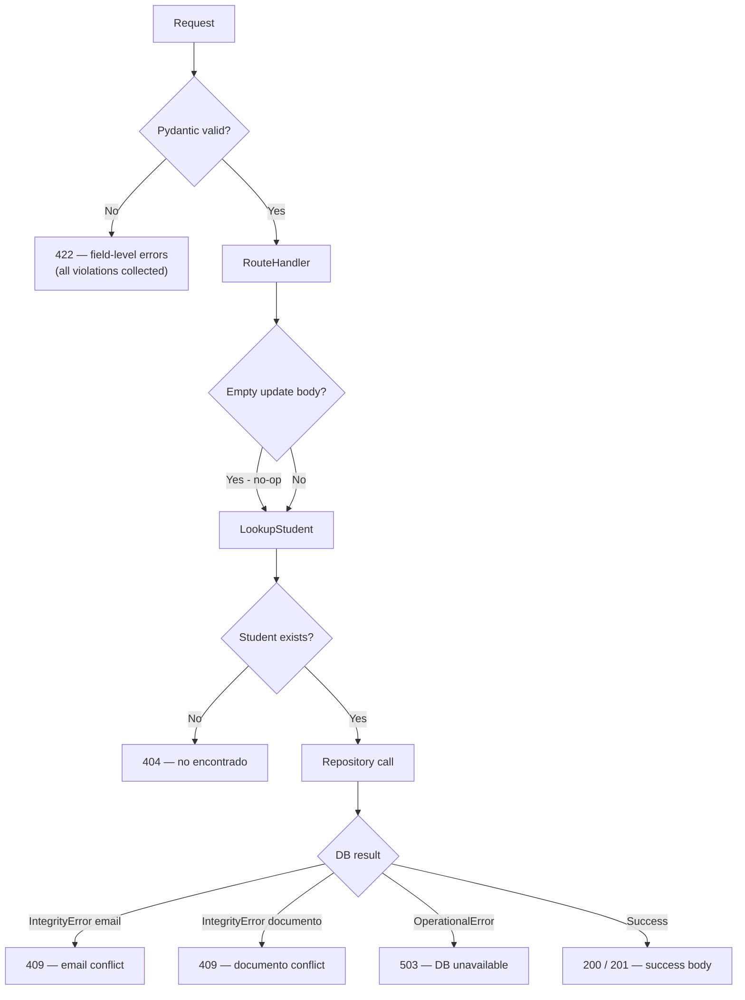

# Design Document — Sistema de Gestión de Estudiantes

## Overview

The student management system is a RESTful HTTP API that gives academic
administrators a single, authoritative store for student records. The API is
built with **FastAPI 0.111+** and backed by **PostgreSQL 14+** through
**SQLAlchemy 2.0**. It exposes five CRUD endpoints for the `Estudiante`
resource, plus health-check and documentation endpoints.

The design follows a classic three-tier layered architecture:

```
HTTP Client
    │
    ▼
┌─────────────────────────────────────────────────────┐
│               FastAPI Application Layer              │
│  main.py · CORS Middleware · Lifespan · /health · / │
└────────────────────┬────────────────────────────────┘
                     │ HTTP routing
                     ▼
┌─────────────────────────────────────────────────────┐
│                  Router Layer                        │
│           routers/students.py                        │
│  POST / · GET / · GET /{id} · PUT /{id} · DELETE    │
│  – Pydantic v2 validation (schemas.py)               │
│  – IntegrityError → 409 translation                  │
└────────────────────┬────────────────────────────────┘
                     │ Python function calls
                     ▼
┌─────────────────────────────────────────────────────┐
│                  Repository Layer                     │
│                    crud.py                           │
│  crear · obtener · listar · actualizar · eliminar    │
│  – SQLAlchemy 2.0 ORM statements                     │
│  – model_dump(exclude_unset=True) for partial update │
└────────────────────┬────────────────────────────────┘
                     │ SQLAlchemy ORM / QueuePool
                     ▼
┌─────────────────────────────────────────────────────┐
│             Database Layer (PostgreSQL)              │
│      table: estudiantes                              │
│      unique indexes: email, numero_documento         │
└─────────────────────────────────────────────────────┘
```

**Key design principles:**

- **Layered separation**: HTTP concerns live in the router; SQL concerns live in
  `crud.py`. Neither layer bleeds into the other.
- **Fail-fast validation**: Pydantic v2 validates every request payload before
  it reaches the repository, collecting all field errors in a single pass.
- **Integrity at two levels**: unique constraints are enforced both in Pydantic
  (format) and in PostgreSQL (identity uniqueness). `IntegrityError` from the
  DB is translated to a human-readable 409 at the router boundary.
- **Dependency injection**: `get_db()` is injected via FastAPI `Depends`,
  making the DB session replaceable in tests without patching internals.

---

## Architecture

### Component Diagram



### Request Lifecycle



### Dependency Injection Chain



---

## Components and Interfaces

### `main.py` — Application Entry Point

| Responsibility | Detail |
|---|---|
| App creation | `FastAPI(title, description, version, lifespan=lifespan)` |
| CORS | `CORSMiddleware(allow_origins=["*"], allow_methods=["*"], allow_headers=["*"])` |
| Lifespan | Calls `verificar_conexion()` at startup; logs warning if DB unreachable |
| Root endpoint | `GET /` → `{mensaje, version, docs, redoc}` |
| Health endpoint | `GET /health` → `{"api":"ok","base_de_datos":"ok"}` (200) or `{"api":"ok","base_de_datos":"error"}` (503) |
| Router inclusion | `app.include_router(students.router)` |

### `routers/students.py` — Router Layer

| Endpoint | Method | Path | Success | Key Errors |
|---|---|---|---|---|
| crear_estudiante | POST | `/students/` | 201 | 409, 422 |
| listar_estudiantes | GET | `/students/` | 200 | 422 |
| obtener_estudiante | GET | `/students/{id}` | 200 | 404, 422 |
| actualizar_estudiante | PUT | `/students/{id}` | 200 | 404, 409, 422 |
| eliminar_estudiante | DELETE | `/students/{id}` | 200 | 404 |

The router uses two private helpers:

- **`_get_or_404(db, id)`** — fetches a student or raises `HTTPException(404)` with detail `"Estudiante con id={id} no encontrado."`.
- **`_handle_integrity_error(exc)`** — parses `exc.orig` string for the keywords `"email"` or `"numero_documento"` and returns the appropriate `HTTPException(409)`.

An empty body `{}` is treated as a successful no-op: the router detects `datos.model_dump(exclude_unset=True) == {}` and returns the current student unchanged (200), per Requirement 4.3.

### `schemas.py` — Pydantic v2 Validation Layer

```
EstudianteBase (shared validators)
├── EstudianteCreate  (POST body: all 4 fields required)
└── EstudianteUpdate  (PUT body: all 5 fields optional)

EstudianteResponse   (API output: all 7 fields including id, activo, fecha_creacion)
EstudiantePaginado   (GET list response: total, pagina, por_pagina, estudiantes[])
```

Field-level validators (both `Create` and `Update`):

| Field | Rule |
|---|---|
| `nombre` | strip whitespace; non-empty; max 200 chars |
| `direccion` | strip whitespace; non-empty; max 500 chars |
| `numero_documento` | strip; must match `^[A-Za-z0-9\-]{3,30}$` |
| `email` | delegated to Pydantic `EmailStr` (RFC 5322, max 254 chars) |

`EstudianteUpdate` validators apply rules only when the field is `not None`,
enabling true partial-update semantics.

### `crud.py` — Repository Layer

| Function | Signature | Notes |
|---|---|---|
| `crear_estudiante` | `(db, EstudianteCreate) → Estudiante` | Raises `IntegrityError` on duplicate key |
| `obtener_estudiante_por_id` | `(db, int) → Optional[Estudiante]` | Uses `db.get()` (primary key lookup) |
| `obtener_estudiante_por_email` | `(db, str) → Optional[Estudiante]` | Uses `select().where()` |
| `obtener_estudiante_por_documento` | `(db, str) → Optional[Estudiante]` | Uses `select().where()` |
| `listar_estudiantes` | `(db, pagina, por_pagina, solo_activos) → (list[Estudiante], int)` | Returns `(page_slice, total)` |
| `actualizar_estudiante` | `(db, Estudiante, EstudianteUpdate) → Estudiante` | `model_dump(exclude_unset=True)` |
| `eliminar_estudiante` | `(db, Estudiante) → None` | `db.delete(); db.commit()` |

`listar_estudiantes` runs **two queries** in the same session: a `COUNT` query
for the total and a `SELECT` with `OFFSET`/`LIMIT` for the page. Both queries
apply the same optional `activo` filter to ensure consistency between `total`
and `estudiantes`.

### `database.py` — Database Infrastructure

```python
engine = create_engine(
    database_url,
    poolclass=QueuePool,
    pool_size=10,       # max active connections
    max_overflow=20,    # overflow above pool_size
    pool_pre_ping=True, # liveness check before each use
    pool_recycle=1800,  # recycle idle connections after 30 min
)
```

`get_db()` is a generator that yields a `SessionLocal()` instance and
guarantees `db.close()` in the `finally` block, returning the connection to the
pool regardless of whether the request succeeded or raised an exception.

`verificar_conexion()` runs `SELECT 1` against the engine and returns `True` or
`False`, used by both the lifespan hook and the `/health` endpoint.

---

## Data Models

### PostgreSQL Table: `estudiantes`

```sql
CREATE TABLE estudiantes (
    id               SERIAL PRIMARY KEY,
    nombre           VARCHAR(200)  NOT NULL,
    direccion        VARCHAR(500)  NOT NULL,
    numero_documento VARCHAR(30)   NOT NULL,
    email            VARCHAR(254)  NOT NULL,
    fecha_creacion   TIMESTAMPTZ   NOT NULL DEFAULT NOW(),
    activo           BOOLEAN       NOT NULL DEFAULT TRUE,

    CONSTRAINT uq_estudiantes_email
        UNIQUE (email),
    CONSTRAINT uq_estudiantes_numero_documento
        UNIQUE (numero_documento)
);

CREATE INDEX ix_estudiantes_id ON estudiantes (id);
CREATE INDEX ix_estudiantes_email ON estudiantes (email);
CREATE INDEX ix_estudiantes_numero_documento ON estudiantes (numero_documento);
```

### SQLAlchemy ORM Model

```python
class Estudiante(Base):
    __tablename__ = "estudiantes"

    id:               Mapped[int]      = mapped_column(Integer, primary_key=True, autoincrement=True)
    nombre:           Mapped[str]      = mapped_column(String(200), nullable=False)
    direccion:        Mapped[str]      = mapped_column(String(500), nullable=False)
    numero_documento: Mapped[str]      = mapped_column(String(30),  nullable=False, unique=True)
    email:            Mapped[str]      = mapped_column(String(254), nullable=False, unique=True)
    fecha_creacion:   Mapped[datetime] = mapped_column(DateTime(timezone=True), server_default=func.now())
    activo:           Mapped[bool]     = mapped_column(Boolean, nullable=False, default=True)
```

Key decisions:
- `fecha_creacion` uses `server_default=func.now()`, delegating timestamp
  generation to PostgreSQL to avoid client clock skew.
- `activo` defaults to `True` at the ORM layer; the repository never passes it
  explicitly on create, so the DB default is the source of truth.
- `email` is stored as `str` (converted from `EmailStr` before persistence to
  avoid SQLAlchemy type mismatch).

### Entity Relationship



The `estudiantes` table is self-contained with no foreign keys in the current
scope. Unique constraints on `email` and `numero_documento` are enforced at the
DB level as the final safety net for concurrent writes that bypass the
application layer.

---

## Correctness Properties

*A property is a characteristic or behavior that should hold true across all valid executions of a system — essentially, a formal statement about what the system should do. Properties serve as the bridge between human-readable specifications and machine-verifiable correctness guarantees.*

---

### Property 1: Creation round-trip — input fields preserved in response

*For any* valid `EstudianteCreate` payload `p`, the API response body `r`
returned by `POST /students/` SHALL satisfy:
`r.nombre == p.nombre`, `r.email == p.email`,
`r.numero_documento == p.numero_documento`, and `r.direccion == p.direccion`.

**Validates: Requirements 1.10**

---

### Property 2: New-student invariants

*For any* valid `EstudianteCreate` payload, the created student returned in the
`POST /students/` response SHALL have `activo == True` and a non-null
`fecha_creacion` value.

**Validates: Requirements 1.9**

---

### Property 3: Schema serialization round-trip

*For any* valid `EstudianteCreate` instance `s`, serializing it to a dict with
`s.model_dump()` and reconstructing it with `EstudianteCreate(**s.model_dump())`
SHALL produce an instance `s2` such that all field values of `s2` equal those
of `s`.

**Validates: Requirements 6.6**

---

### Property 4: Response schema completeness

*For any* existing student, `GET /students/{id}` SHALL return a response object
containing all seven fields: `id` (int), `nombre` (str), `direccion` (str),
`numero_documento` (str), `email` (str), `activo` (bool), and `fecha_creacion`
(ISO 8601 string).

**Validates: Requirements 2.1, 2.4**

---

### Property 5: Pagination correctness

*For any* dataset of `n` students ordered by `id` and pagination parameters
`pagina=N` and `por_pagina=M`, the API SHALL return exactly the students at
database offset `(N-1)*M` through `(N-1)*M + M - 1`, in ascending `id` order.

**Validates: Requirements 3.3**

---

### Property 6: Pagination completeness invariant

*For any* valid dataset of `n` students and page size `M`, iterating through
all pages from `pagina=1` to `ceil(n/M)` and collecting all returned
`estudiantes` lists SHALL yield exactly `n` distinct student records — equal to
the `total` value reported in each page response.

**Validates: Requirements 3.10, 3.9**

---

### Property 7: Filter correctness

*For any* dataset containing both active and inactive students, a `GET
/students/?activo=true` request SHALL return only records where `activo ==
True`, and a `GET /students/?activo=false` request SHALL return only records
where `activo == False`. In both cases, `total` SHALL equal the count of
matching records in the dataset.

**Validates: Requirements 3.6, 3.7, 3.9**

---

### Property 8: Partial update invariant

*For any* existing student `s` and any non-empty subset of updatable fields
`F ⊂ {nombre, direccion, numero_documento, email, activo}`, a `PUT
/students/{s.id}` request supplying only the fields in `F` SHALL update the
fields in `F` to their new values and leave all fields not in `F` unchanged
from their original values in `s`.

**Validates: Requirements 4.1, 4.9**

---

### Property 9: Deletion round-trip (visibility invariant)

*For any* existing student `s`, after a successful `DELETE /students/{s.id}`
request, a subsequent `GET /students/{s.id}` SHALL return `404 Not Found`.

**Validates: Requirements 5.1, 5.6**

---

### Property 10: Deletion count invariant

*For any* collection of `n` students, after deleting one student, the `total`
field returned by `GET /students/` SHALL equal `n - 1`.

**Validates: Requirements 5.5**

---

## Error Handling

### Error Response Taxonomy

| HTTP Status | Trigger | `detail` content |
|---|---|---|
| 400 Bad Request | Malformed request (non-empty body, structural error) | `detail` describes the reason |
| 404 Not Found | ID does not exist; negative/zero ID | contains "no encontrado" |
| 409 Conflict | Duplicate `email` | contains "email" |
| 409 Conflict | Duplicate `numero_documento` | contains "documento" |
| 422 Unprocessable Entity | Pydantic validation failure | array of `{loc, msg, type}` per field |
| 503 Service Unavailable | DB unreachable on `POST` or `/health` | `{"api":"ok","base_de_datos":"error"}` |

### Error Translation Flow



### IntegrityError Parsing

`_handle_integrity_error(exc)` inspects `str(exc.orig).lower()`. PostgreSQL
surfaces the constraint name in the error message, which contains either
`"email"` or `"numero_documento"`. This string matching is intentionally
simple; if neither keyword is found the response returns a generic
"Conflicto de datos" message.

### Session Rollback on Error

The router explicitly calls `db.rollback()` before re-raising a translated
exception on `IntegrityError`. This prevents the session from being left in a
broken transaction state before it is returned to the pool by `get_db()`.

---

## Testing Strategy

### Dual-Layer Testing Approach

The test suite uses **two complementary layers**:

1. **Unit tests with SQLite in-memory** — fast, no external dependencies,
   cover all validation, logic, and CRUD paths.
2. **Integration tests with real PostgreSQL** — verify actual constraint
   enforcement, pool behavior, and end-to-end HTTP flow. Auto-skipped when
   PostgreSQL is unavailable.

### Test Infrastructure

```
tests/
  conftest.py          # fixtures: db_session (SQLite), client (FastAPI+SQLite),
                       #           db_postgres (real PG), client_pg (FastAPI+PG)
  test_students.py     # unit tests: all endpoints, all status codes, all edge cases
  test_integration.py  # integration tests: real PG, concurrent requests, pool behavior
```

#### SQLite Fixture Details

```python
engine_test = create_engine(
    "sqlite:///:memory:",
    connect_args={"check_same_thread": False},
    poolclass=StaticPool,   # single shared connection across threads
)
```

`StaticPool` ensures that the same in-memory DB instance is shared between the
SQLAlchemy session and FastAPI's TestClient threads. `Base.metadata.create_all`
and `drop_all` are called per test function for full isolation.

#### PostgreSQL Fixture Details

The `db_postgres` fixture checks connectivity via `_pg_available()` and skips
with `pytest.skip()` if PostgreSQL is unreachable. After each test, it deletes
all rows from `estudiantes` (not the schema) to avoid test pollution while
preserving table structure.

### Property-Based Testing

The project uses **[Hypothesis](https://hypothesis.readthedocs.io/)** as the
property-based testing library. Each property test is tagged with a comment
referencing its design property.

```python
# Feature: student-management, Property 1: Creation round-trip
@given(st.builds(EstudianteCreate, ...))
@settings(max_examples=100)
def test_creation_round_trip(client, payload): ...
```

Each property-based test runs a **minimum of 100 examples**. Tests use the
SQLite in-memory fixture for speed, so no external service is required.

### Unit Test Coverage Targets

| Area | Test approach |
|---|---|
| POST /students/ valid | Property test (creation round-trip, Property 1 & 2) |
| POST /students/ duplicate email/documento | Example tests |
| POST /students/ missing/invalid fields | Edge case tests (one per field) |
| GET /students/{id} found | Property test (schema completeness, Property 4) |
| GET /students/{id} not found | Example test |
| GET /students/ pagination | Property tests (Properties 5 & 6) |
| GET /students/ filter | Property test (Property 7) |
| PUT /students/{id} partial update | Property test (Property 8) |
| PUT /students/{id} empty body (no-op 200) | Example test |
| PUT /students/{id} conflicts | Example tests |
| DELETE /students/{id} visibility | Property test (Property 9) |
| DELETE /students/{id} count | Property test (Property 10) |
| Pydantic schema round-trip | Property test (Property 3) |
| /health DB up | Example test |
| /health DB down | Example test (mock `verificar_conexion`) |
| / root endpoint | Example test |
| CORS headers | Example test |
| Multi-field validation errors | Example test |

### Integration Test Coverage

| Scenario | Approach |
|---|---|
| Unique constraint enforcement at DB level | Insert duplicate, verify 409 |
| End-to-end create → list → get → update → delete | Sequential example test |
| Concurrent requests | Thread pool test, verify no 500s |
| Session close on exception | Verify pool returns connection on forced error |

### Running Tests

```bash
# Unit tests only (no PostgreSQL required)
pytest tests/test_students.py -v

# All tests including integration (requires running PostgreSQL)
pytest -v

# Single test run (non-watch mode for CI)
pytest --tb=short -q
```

