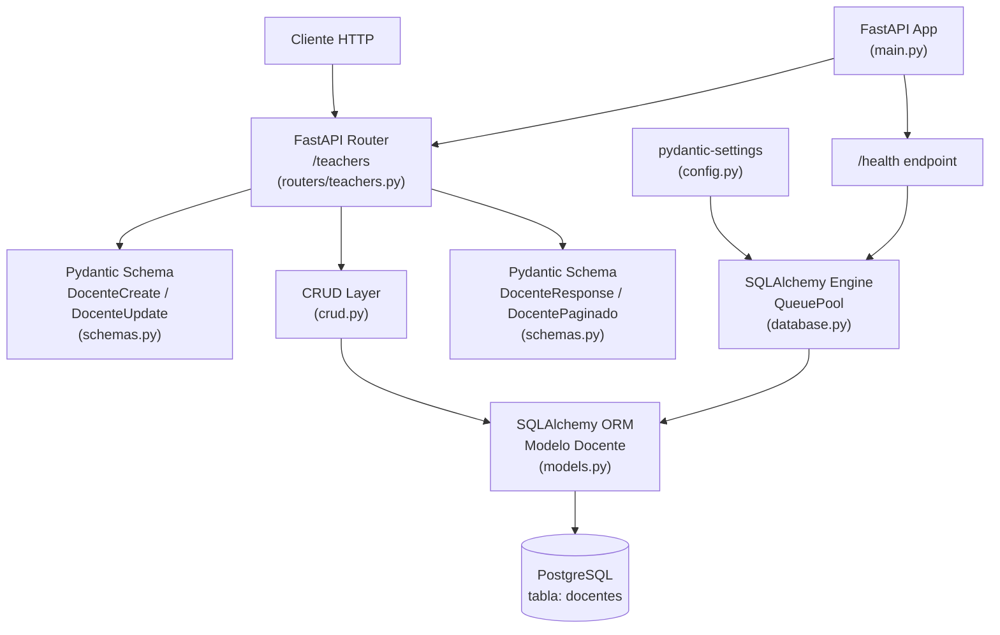

# Documento de Diseño Técnico: Gestión de Docentes (`teacher-management`)

## Overview

Este documento describe el diseño técnico del módulo de **Gestión de Docentes** para el Sistema de Gestión Académica. El módulo sigue exactamente los mismos patrones arquitectónicos del módulo de estudiantes ya implementado: FastAPI + SQLAlchemy 2.0 + PostgreSQL + Pydantic v2.

Se agregan cinco endpoints CRUD bajo el prefijo `/teachers`, un modelo ORM `Docente`, esquemas Pydantic para validación, funciones de acceso a datos en `crud.py`, un script de migración SQL, un script de inicialización Python y una suite de pruebas unitarias con SQLite en memoria.

El objetivo es extender el sistema existente sin romper ninguna funcionalidad del módulo de estudiantes.

---

## Architecture

La cadena de procesamiento de cada solicitud HTTP es idéntica a la del módulo de estudiantes:

```
┌────────────┐     HTTP      ┌─────────────────┐    Python    ┌─────────────────┐
│  Cliente   │ ────────────► │  FastAPI Router  │ ──────────► │   CRUD Layer    │
│ (curl/UI)  │               │ routers/teachers │             │  (crud.py)      │
└────────────┘               └─────────────────┘             └────────┬────────┘
                                      │                                │ SQLAlchemy 2.0
                                      │ Pydantic v2                    │ ORM / Session
                                      │ (validación entrada/salida)    ▼
                                      │                       ┌─────────────────┐
                                      │                       │  PostgreSQL DB  │
                                      │                       │  tabla: docentes│
                                      └───────────────────────┘
```

**Diagrama de componentes completo (Mermaid):**



---

## Components and Interfaces

### 1. Router — `app/routers/teachers.py`

**Responsabilidad**: Recibir solicitudes HTTP, validar parámetros de ruta y query con FastAPI/Pydantic, delegar la lógica de negocio al CRUD Layer, traducir excepciones de base de datos a respuestas HTTP legibles.

**Interfaz pública (endpoints)**:

| Función | Método | Ruta | Descripción |
|---|---|---|---|
| `crear_docente` | POST | `/teachers/` | Crea un nuevo docente |
| `listar_docentes` | GET | `/teachers/` | Lista paginada con filtro opcional |
| `obtener_docente` | GET | `/teachers/{docente_id}` | Obtiene un docente por ID |
| `actualizar_docente` | PUT | `/teachers/{docente_id}` | Actualización parcial |
| `eliminar_docente` | DELETE | `/teachers/{docente_id}` | Eliminación permanente |

**Helpers internos**:
- `_get_or_404(db, docente_id)` → devuelve el `Docente` o lanza `HTTP 404`
- `_handle_integrity_error(exc)` → traduce `IntegrityError` a `HTTP 409` identificando el campo en conflicto (`email` o `especialidad`)

**Registro en `main.py`**:
```python
from app.routers import teachers
app.include_router(teachers.router)
```

---

### 2. CRUD Layer — `app/crud.py` (extensión)

**Responsabilidad**: Encapsular todas las operaciones de base de datos sobre la tabla `docentes`. No contiene lógica HTTP.

**Funciones a agregar**:

| Función | Descripción |
|---|---|
| `crear_docente(db, datos)` | Inserta un nuevo `Docente`, puede lanzar `IntegrityError` |
| `obtener_docente_por_id(db, id)` | Devuelve `Docente` o `None` |
| `obtener_docente_por_email(db, email)` | Devuelve `Docente` o `None` |
| `obtener_docente_por_especialidad(db, especialidad)` | Devuelve `Docente` o `None` |
| `listar_docentes(db, pagina, por_pagina, solo_activos)` | Devuelve `(list[Docente], int)` |
| `actualizar_docente(db, docente, datos)` | Aplica `model_dump(exclude_unset=True)`, puede lanzar `IntegrityError` |
| `eliminar_docente(db, docente)` | Eliminación permanente |

---

### 3. Schemas — `app/schemas.py` (extensión)

**Responsabilidad**: Validación de entrada y serialización de salida con Pydantic v2.

**Schemas a agregar**:

| Clase | Uso | Campos |
|---|---|---|
| `DocenteBase` | Base compartida | `nombre`, `email`, `especialidad` |
| `DocenteCreate` | POST request body | hereda `DocenteBase` |
| `DocenteUpdate` | PUT request body (todos opcionales) | `nombre?`, `email?`, `especialidad?`, `activo?` |
| `DocenteResponse` | Respuesta GET/POST/PUT | `DocenteBase` + `id`, `activo`, `fecha_creacion` |
| `DocentePaginado` | Respuesta GET lista | `total`, `pagina`, `por_pagina`, `docentes` |

---

### 4. Model — `app/models.py` (extensión)

**Responsabilidad**: Representar la tabla `docentes` como clase ORM SQLAlchemy 2.0.

---

### 5. Database — `app/database.py` (sin modificación)

El pool de conexiones (`QueuePool`) y la dependencia `get_db()` se reutilizan sin cambios. El modelo `Docente` se registra automáticamente en `Base.metadata` al importar `app.models`.

---

### 6. Migration — `migrations/create_teachers_table.sql`

DDL idempotente para crear la tabla `docentes` con sus constraints e índices.

---

### 7. Init Script — `init_db.py`

Script Python ejecutable directamente que conecta al motor SQLAlchemy, lee el archivo SQL de migración y lo ejecuta. Reporta éxito en stdout y errores en stderr con código de salida no-cero.

---

## Data Models

### Modelo ORM `Docente`

```python
# app/models.py (agregar junto al modelo Estudiante existente)

class Docente(Base):
    __tablename__ = "docentes"

    id: Mapped[int] = mapped_column(
        Integer, primary_key=True, index=True, autoincrement=True
    )
    nombre: Mapped[str] = mapped_column(String(200), nullable=False)
    email: Mapped[str] = mapped_column(
        String(254), nullable=False, unique=True, index=True
    )
    especialidad: Mapped[str] = mapped_column(
        String(200), nullable=False, unique=True, index=True
    )
    fecha_creacion: Mapped[datetime] = mapped_column(
        DateTime(timezone=True),
        nullable=False,
        server_default=func.now(),
    )
    activo: Mapped[bool] = mapped_column(Boolean, nullable=False, default=True)
```

**Constraints**:
- `email`: `UNIQUE`, índice B-tree
- `especialidad`: `UNIQUE`, índice B-tree
- `nombre`, `email`, `especialidad`: `NOT NULL`
- `fecha_creacion`: `NOT NULL`, `DEFAULT NOW()`
- `activo`: `NOT NULL`, `DEFAULT TRUE`

**Diferencias respecto a `Estudiante`**:
- No tiene `direccion` ni `numero_documento`
- Tiene `especialidad` (también única, máx. 200 chars)
- Los campos únicos son `email` y `especialidad` (en vez de `email` y `numero_documento`)

---

### Schemas Pydantic

```python
class DocenteBase(BaseModel):
    nombre: str       # strip + no vacío + máx 200 chars
    email: EmailStr   # validación RFC 5322
    especialidad: str # strip + no vacío + máx 200 chars

class DocenteCreate(DocenteBase):
    pass

class DocenteUpdate(BaseModel):
    nombre: Optional[str] = None
    email: Optional[EmailStr] = None
    especialidad: Optional[str] = None
    activo: Optional[bool] = None

class DocenteResponse(DocenteBase):
    id: int
    activo: bool
    fecha_creacion: datetime
    model_config = {"from_attributes": True}

class DocentePaginado(BaseModel):
    total: int
    pagina: int
    por_pagina: int
    docentes: list[DocenteResponse]
```

**Validadores `field_validator` en `DocenteBase`** (patrón idéntico a `EstudianteBase`):
- `nombre_no_vacio`: `strip()`, rechaza vacío, rechaza longitud > 200
- `especialidad_no_vacia`: `strip()`, rechaza vacío, rechaza longitud > 200

**Validadores en `DocenteUpdate`** (idéntica lógica con valores opcionales):
- Mismas reglas, solo se aplican cuando el campo no es `None`

---

## API Design

### POST `/teachers/`

| Aspecto | Detalle |
|---|---|
| Request body | `DocenteCreate` |
| Response body | `DocenteResponse` |
| Success | HTTP 201 |
| Errores | 409 (email/especialidad duplicada), 422 (validación), 503 (BD no disponible) |

**Request body ejemplo**:
```json
{
  "nombre": "María Fernández",
  "email": "maria.fernandez@escuela.edu",
  "especialidad": "Matemáticas"
}
```

**Response ejemplo (201)**:
```json
{
  "id": 1,
  "nombre": "María Fernández",
  "email": "maria.fernandez@escuela.edu",
  "especialidad": "Matemáticas",
  "fecha_creacion": "2024-01-15T10:30:00Z",
  "activo": true
}
```

---

### GET `/teachers/{docente_id}`

| Aspecto | Detalle |
|---|---|
| Path param | `docente_id: int` |
| Response body | `DocenteResponse` |
| Success | HTTP 200 (incluso si `activo=false`) |
| Errores | 404 (no encontrado), 422 (id no entero) |

---

### GET `/teachers/`

| Aspecto | Detalle |
|---|---|
| Query params | `pagina: int = 1` (≥1), `por_pagina: int = 10` (1–100), `activo: bool = None` |
| Response body | `DocentePaginado` |
| Success | HTTP 200 |
| Errores | 422 (parámetros fuera de rango o tipo inválido) |

**Response ejemplo (200)**:
```json
{
  "total": 25,
  "pagina": 1,
  "por_pagina": 10,
  "docentes": [...]
}
```

Ordenamiento: por `id` ascendente (garantiza paginación determinista).

---

### PUT `/teachers/{docente_id}`

| Aspecto | Detalle |
|---|---|
| Path param | `docente_id: int` |
| Request body | `DocenteUpdate` (todos los campos opcionales) |
| Response body | `DocenteResponse` |
| Success | HTTP 200 |
| Errores | 404, 409 (conflicto de unicidad), 422 (validación) |

**Comportamiento clave**:
- Body vacío `{}` → no-op, devuelve el docente sin modificar (`model_dump(exclude_unset=True)` vacío)
- Solo se actualizan los campos presentes en el body

---

### DELETE `/teachers/{docente_id}`

| Aspecto | Detalle |
|---|---|
| Path param | `docente_id: int` |
| Response body | `{"mensaje": "Docente con id={id} eliminado exitosamente."}` |
| Success | HTTP 200 |
| Errores | 404, 422, 503 (BD no disponible) |

---

### GET `/health` (actualización)

El endpoint existente en `main.py` retorna el estado de la BD. No requiere cambios funcionales; el pool de `Docente` reutiliza el mismo engine. El health check sigue reflejando el estado de conexión a PostgreSQL para ambos módulos.

---

## Error Handling

| Condición | HTTP | Mensaje |
|---|---|---|
| `nombre` vacío o solo espacios | 422 | `"El nombre no puede estar vacío."` |
| `nombre` > 200 caracteres | 422 | `"El nombre no puede superar los 200 caracteres."` |
| `email` con formato inválido | 422 | Error de Pydantic indicando campo `email` |
| `especialidad` vacía o solo espacios | 422 | `"La especialidad no puede estar vacía."` |
| `especialidad` > 200 caracteres | 422 | `"La especialidad no puede superar los 200 caracteres."` |
| `email` duplicado en INSERT | 409 | `"Ya existe un docente registrado con ese email."` |
| `especialidad` duplicada en INSERT | 409 | `"Ya existe un docente registrado con esa especialidad."` |
| `docente_id` no existe en GET/PUT/DELETE | 404 | `"Docente con id={id} no encontrado."` |
| `docente_id` no es entero | 422 | Error FastAPI de validación de path param |
| `pagina < 1` | 422 | Error de Query param `ge=1` |
| `por_pagina > 100` | 422 | Error de Query param `le=100` |
| `por_pagina < 1` | 422 | Error de Query param `ge=1` |
| `activo` con valor no booleano | 422 | Error FastAPI de tipo |
| BD no disponible | 503 | Manejado por la excepción de SQLAlchemy propagada |

**Estrategia de captura de `IntegrityError`** (idéntica a `students.py`):

```python
def _handle_integrity_error(exc: IntegrityError) -> HTTPException:
    msg = str(exc.orig).lower()
    if "email" in msg:
        detail = "Ya existe un docente registrado con ese email."
    elif "especialidad" in msg:
        detail = "Ya existe un docente registrado con esa especialidad."
    else:
        detail = "Conflicto de datos: el registro ya existe."
    return HTTPException(status_code=status.HTTP_409_CONFLICT, detail=detail)
```

---

## Database Schema

### DDL — `migrations/create_teachers_table.sql`

```sql
-- =============================================================================
-- Migración: Crear tabla de docentes
-- Base de datos: gac
-- =============================================================================

CREATE TABLE IF NOT EXISTS docentes (
    id             SERIAL PRIMARY KEY,
    nombre         VARCHAR(200)  NOT NULL,
    email          VARCHAR(254)  NOT NULL,
    especialidad   VARCHAR(200)  NOT NULL,
    fecha_creacion TIMESTAMPTZ   NOT NULL DEFAULT NOW(),
    activo         BOOLEAN       NOT NULL DEFAULT TRUE,

    CONSTRAINT uq_docentes_email       UNIQUE (email),
    CONSTRAINT uq_docentes_especialidad UNIQUE (especialidad)
);

CREATE INDEX IF NOT EXISTS idx_docentes_email
    ON docentes (email);

CREATE INDEX IF NOT EXISTS idx_docentes_especialidad
    ON docentes (especialidad);

COMMENT ON TABLE  docentes                    IS 'Registro de docentes del sistema académico';
COMMENT ON COLUMN docentes.id                 IS 'Identificador único autogenerado';
COMMENT ON COLUMN docentes.nombre             IS 'Nombre completo del docente';
COMMENT ON COLUMN docentes.email              IS 'Correo electrónico institucional (único)';
COMMENT ON COLUMN docentes.especialidad       IS 'Área de especialización del docente (única)';
COMMENT ON COLUMN docentes.fecha_creacion     IS 'Fecha y hora de registro (UTC)';
COMMENT ON COLUMN docentes.activo             IS 'Indica si el docente está activo en el sistema';
```

### Init Script — `init_db.py`

```python
"""
Script de inicialización: ejecuta las migraciones SQL pendientes.
Uso: python init_db.py
"""
import sys
from pathlib import Path
from sqlalchemy import text
from app.database import engine

MIGRATION = Path("migrations/create_teachers_table.sql")

def run():
    try:
        sql = MIGRATION.read_text(encoding="utf-8")
        with engine.begin() as conn:
            conn.execute(text(sql))
        print(f"✅ Migración '{MIGRATION}' ejecutada correctamente.")
    except Exception as exc:
        print(f"❌ Error al ejecutar la migración: {exc}", file=sys.stderr)
        sys.exit(1)

if __name__ == "__main__":
    run()
```

---

## Correctness Properties

*A property is a characteristic or behavior that should hold true across all valid executions of a system — essentially, a formal statement about what the system should do. Properties serve as the bridge between human-readable specifications and machine-verifiable correctness guarantees.*

### Property 1: Round-trip de creación y lectura

*Para cualquier* conjunto de datos de docente válidos (nombre no vacío ≤200 chars, email RFC 5322, especialidad no vacía ≤200 chars), crear el docente mediante `POST /teachers/` y luego consultarlo con `GET /teachers/{id}` debe devolver exactamente los mismos valores de `nombre`, `email`, `especialidad`, y el docente debe tener `activo=true` y un `id` positivo.

**Validates: Requirements 1.1, 1.2, 2.1**

---

### Property 2: Rechazo universal de campos en blanco

*Para cualquier* string compuesto únicamente de espacios en blanco (incluido el string vacío), enviarlo como valor de `nombre` o `especialidad` en `POST /teachers/` debe resultar en HTTP 422, y ningún dato debe persistirse.

**Validates: Requirements 1.5, 8.1, 8.4**

---

### Property 3: Rechazo universal de emails con formato inválido

*Para cualquier* string que no cumple el formato RFC 5322 (sin `@`, dominio sin punto, longitud > 254 chars, etc.), enviarlo como valor de `email` en `POST /teachers/` o `PUT /teachers/{id}` debe resultar en HTTP 422.

**Validates: Requirements 1.6, 8.3**

---

### Property 4: El filtro de estado es exhaustivo

*Para cualquier* conjunto de docentes con valores `activo` mixtos, al consultar `GET /teachers?activo=true` todos los docentes devueltos deben tener `activo=true`, y al consultar `GET /teachers?activo=false` todos deben tener `activo=false`. Ningún docente del resultado debe violar el filtro aplicado.

**Validates: Requirements 3.7**

---

### Property 5: Ordenamiento determinista por ID

*Para cualquier* secuencia de docentes creados, la lista devuelta por `GET /teachers` debe estar ordenada estrictamente por `id` ascendente, independientemente del orden de inserción.

**Validates: Requirements 3.10**

---

### Property 6: Actualización parcial preserva campos no enviados

*Para cualquier* docente existente y cualquier subconjunto no vacío de campos válidos enviados en `PUT /teachers/{id}`, los campos no incluidos en el body deben conservar exactamente los valores que tenían antes de la actualización.

**Validates: Requirements 4.1, 4.6**

---

### Property 7: La eliminación hace el recurso inaccesible

*Para cualquier* docente existente, eliminarlo con `DELETE /teachers/{id}` debe resultar en que `GET /teachers/{id}` devuelva HTTP 404 y en que el docente no aparezca en los resultados de `GET /teachers`.

**Validates: Requirements 5.1, 5.3**

---

## Testing Strategy

### Enfoque dual

El módulo combina **pruebas de ejemplo** (casos concretos con comportamiento específico) y **pruebas basadas en propiedades** (cobertura amplia sobre el espacio de entradas). Ambas son complementarias: las pruebas de ejemplo verifican comportamientos concretos y los casos de error; las pruebas de propiedades verifican invariantes universales.

### Pruebas Unitarias — `tests/test_teachers.py`

- **Base de datos**: SQLite en memoria (mismo patrón que `tests/test_students.py`)
- **Fixtures**: Reutiliza `client` y `db_session` de `tests/conftest.py`; no requiere cambios al conftest
- **Aislamiento**: Cada caso de prueba obtiene una BD limpia (el fixture recrea `Base.metadata` por función)
- **Sin dependencia de PostgreSQL**: Todos los casos unitarios deben pasar sin conexión activa a PostgreSQL

**Cobertura mínima por endpoint**:

| Endpoint | Casos de éxito | Casos de error |
|---|---|---|
| `POST /teachers/` | 201 con datos completos | 409 email dup, 409 especialidad dup, 422 campos vacíos, 422 email inválido |
| `GET /teachers/{id}` | 200 con datos correctos, 200 con activo=false | 404, 422 id no entero |
| `GET /teachers/` | 200 vacío, 200 con paginación, filtro activo | 422 por_pagina>100, 422 pagina<1 |
| `PUT /teachers/{id}` | 200 parcial, 200 body vacío (no-op) | 404, 409, 422 |
| `DELETE /teachers/{id}` | 200 con mensaje, recurso ya no accesible | 404, 422 id no entero |

### Pruebas de Propiedades — `tests/test_teachers.py` (sección PBT)

**Librería**: `hypothesis` (instalar como dependencia de desarrollo: `pip install hypothesis`)

**Configuración**: Mínimo 100 iteraciones por propiedad (configurado con `@settings(max_examples=100)`).

**Generadores necesarios**:
- `nombre_valido`: strings no vacíos, sin ser solo espacios, longitud 1-200
- `especialidad_valida`: strings no vacíos, sin ser solo espacios, longitud 1-200
- `email_valido`: emails RFC 5322 válidos (usando `hypothesis[email]`)
- `nombre_invalido`: strings de solo espacios o vacíos
- `email_invalido`: strings sin `@`, sin punto en dominio, o demasiado largos

**Tag format**: `# Feature: teacher-management, Property {N}: {property_text}`

**Implementación esquemática**:

```python
from hypothesis import given, settings, assume
from hypothesis import strategies as st

# Feature: teacher-management, Property 1: Round-trip de creación y lectura
@given(
    nombre=st.text(min_size=1, max_size=200).filter(lambda s: s.strip()),
    especialidad=st.text(min_size=1, max_size=200).filter(lambda s: s.strip()),
    email=st.emails(),
)
@settings(max_examples=100)
def test_property_roundtrip_creacion_lectura(client, nombre, especialidad, email):
    payload = {"nombre": nombre, "email": email, "especialidad": especialidad}
    resp = client.post("/teachers/", json=payload)
    assume(resp.status_code == 201)  # descarta conflictos de unicidad
    data = resp.json()
    assert data["activo"] is True
    assert data["id"] > 0
    get_resp = client.get(f"/teachers/{data['id']}")
    assert get_resp.status_code == 200
    got = get_resp.json()
    assert got["email"] == email.lower() or got["email"] == email
    assert got["activo"] is True

# Feature: teacher-management, Property 2: Rechazo universal de campos en blanco
@given(blanco=st.from_regex(r"^\s+$", fullmatch=True))
@settings(max_examples=100)
def test_property_rechazo_campos_en_blanco(client, blanco):
    payload = {"nombre": blanco, "email": "valido@test.com", "especialidad": "Física"}
    resp = client.post("/teachers/", json=payload)
    assert resp.status_code == 422

# Feature: teacher-management, Property 5: Ordenamiento determinista por ID
@given(n=st.integers(min_value=2, max_value=10))
@settings(max_examples=50)
def test_property_orden_por_id(client, n):
    for i in range(n):
        client.post("/teachers/", json={
            "nombre": f"Docente {i}",
            "email": f"docente{i}@test.com",
            "especialidad": f"Especialidad {i}",
        })
    resp = client.get("/teachers/?por_pagina=100")
    ids = [d["id"] for d in resp.json()["docentes"]]
    assert ids == sorted(ids)
```

### Pruebas de Integración — `tests/test_teachers_integration.py`

- **Base de datos**: PostgreSQL real a través de `TEST_DATABASE_URL`
- **Fixtures**: Reutiliza `client_pg` de `conftest.py`; requiere actualizar el cleanup para incluir `Docente`
- **Skip automático**: Si `TEST_DATABASE_URL` no está definida o PostgreSQL no es alcanzable, todos los casos se marcan como `skipped`
- **Casos**: Al menos un caso de éxito por endpoint contra la BD real; verifica persistencia real y unicidad a nivel de PostgreSQL

**Actualización necesaria en `conftest.py`**: El fixture `db_postgres` limpia la tabla `Estudiante`; debe extenderse para limpiar también `Docente`:

```python
# En db_postgres fixture, sección de limpieza:
from app.models import Docente
session2.query(Docente).delete()
session2.query(Estudiante).delete()
session2.commit()
```

---

## File Structure

### Archivos a crear

| Archivo | Acción | Propósito |
|---|---|---|
| `app/routers/teachers.py` | **Crear** | Router FastAPI con prefijo `/teachers`, 5 endpoints CRUD |
| `migrations/create_teachers_table.sql` | **Crear** | DDL idempotente para tabla `docentes` con índices y constraints |
| `init_db.py` | **Crear** | Script Python para ejecutar la migración programáticamente |
| `tests/test_teachers.py` | **Crear** | Suite de pruebas unitarias con SQLite en memoria + pruebas de propiedades con Hypothesis |
| `tests/test_teachers_integration.py` | **Crear** | Pruebas de integración opcionales contra PostgreSQL real |

### Archivos a modificar

| Archivo | Acción | Cambio requerido |
|---|---|---|
| `app/models.py` | **Modificar** | Agregar clase `Docente(Base)` junto a `Estudiante`; no modificar el modelo existente |
| `app/schemas.py` | **Modificar** | Agregar `DocenteBase`, `DocenteCreate`, `DocenteUpdate`, `DocenteResponse`, `DocentePaginado`; no modificar schemas existentes |
| `app/crud.py` | **Modificar** | Agregar las 7 funciones CRUD para `Docente`; no modificar funciones existentes |
| `app/main.py` | **Modificar** | Agregar `from app.routers import teachers` y `app.include_router(teachers.router)` |
| `tests/conftest.py` | **Modificar** | Actualizar fixture `db_postgres` para limpiar tabla `docentes` además de `estudiantes` |
| `README.md` | **Modificar** | Documentar endpoints, modelo de datos, variables de entorno y comandos del módulo de docentes |
| `requirements.txt` | **Modificar** | Agregar `hypothesis>=6.100.0` para pruebas de propiedades |

### Archivos que NO se modifican

| Archivo | Razón |
|---|---|
| `app/database.py` | El engine, pool y `get_db()` son reutilizados sin cambios |
| `app/config.py` | La configuración de BD aplica a ambos módulos por igual |
| `app/routers/students.py` | El módulo de estudiantes no se toca |
| `migrations/create_students_table.sql` | Migración de estudiantes no se modifica |
| `pytest.ini` | Configuración de pytest no requiere cambios |

---

## Design Decisions

**Por qué `especialidad` es única**: El requisito establece HTTP 409 si se intenta registrar una especialidad duplicada (Req 1.4, 4.5), lo que implica unicidad a nivel de BD — igual que `email`. Esto se implementa con `UNIQUE` constraint en la columna y el índice correspondiente.

**Por qué no hay `direccion` ni `numero_documento`**: El modelo de docente definido en los requisitos es más simple que el de estudiante. Solo tiene `nombre`, `email` y `especialidad` como campos de negocio. No se agregan campos que no están en los requisitos.

**Por qué reusar el mismo `Base`**: SQLAlchemy requiere que todos los modelos compartan la misma instancia de `DeclarativeBase` para que `Base.metadata.create_all()` cree todas las tablas. `Docente` hereda del mismo `Base` importado de `app.database`, lo que permite que el conftest de pruebas unitarias cree ambas tablas en SQLite sin configuración adicional.

**Por qué `hypothesis` para PBT**: Es la librería estándar de property-based testing en Python, mantenida activamente, compatible con pytest, y permite definir generadores sofisticados con estrategias composables. No se implementa PBT desde cero.
